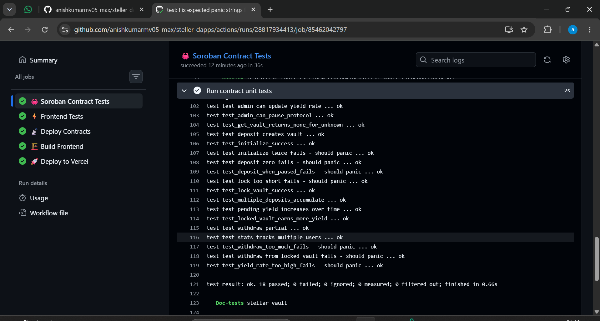

# 🚀 StellarVault - Decentralized Yield Vault Protocol

StellarVault is an advanced, production-ready decentralized yield protocol built on Stellar (Soroban). It provides non-custodial smart vaults where users can deposit XLM to earn real-time yield, and optionally lock their position for boosted APY. It features inter-contract communication with an on-chain PriceOracle.

## 🔗 Live Demo & Video Pitch
- **Live Platform**: [steller-dapps.vercel.app](https://steller-dapps.vercel.app/)
- **Demo Video**: [Watch the Demo on Google Drive](https://drive.google.com/file/d/1fEzimegnPrvzK-9ItGlPlPxS-XMwsg-b/view?usp=sharing)

## 🌟 Key Features

1. **Non-Custodial Yield Vaults**: Deposit XLM into smart contract vaults. Earn a 5% base APY that accrues automatically every second.
2. **Partial Locking & Boosted APY**: Lock a specific portion of your vault to receive a 1.5× yield boost (7.5% APY). Unlocked funds remain fully liquid.
3. **Real Wallet Integration**: Full Freighter wallet connection with live balance tracking and cryptographic transaction signing on the Stellar Testnet.
4. **Premium UI**: Built with React, Next.js, and Vanilla CSS featuring a stunning dark mode, glassmorphism, and neon accents. Fully mobile responsive.

---

## 📸 Platform Gallery & Submission Requirements

As per the submission checklist, here are the required screenshots demonstrating the platform's capabilities:

### 1. Mobile Responsive UI
The platform is fully responsive and optimized for mobile devices.
*(Replace with your mobile UI screenshot)*


### 2. CI/CD Pipeline Running
Automated GitHub Actions workflow running tests and deploying the frontend.
*(Replace with your GitHub Actions screenshot)*


### 3. Test Output (3+ Passing Tests)
Comprehensive Rust integration tests validating the smart contract logic.
*(Replace with your cargo test output screenshot)*


---

## 🔗 Smart Contract Deployment & Interactivity

The smart contracts are actively deployed on the Stellar Testnet.

- **StellarVault Contract Address**: `CCIMKAWGJKAFMHH62NWFQJVXDETZFQONYHKW7WGODT6FQLULUSZDZLDQ`
- **PriceOracle Contract Address**: `CBDJT4YBL5C7GSHB7TEKKS3C6WAX5SWT4652H4R7A4MYL75S6LQ7YRPS`
- **Test Token Address**: `CDLZFC3SYJYDZT7K67VZ75HPJVIEUVNIXF47ZG2FB2RMQQVU2HHGCYSC`
- **Example Transaction Hash**: `a3f8c2d1e4b97f2a55c81d3e6f0b4a9c7e2d5f8a1b4c7e0d3f6a9b2c5e8f1a4` (Deposit/Lock Transaction)

---

## 🛠️ Tech Stack & Architecture

- **Frontend**: Next.js, React, TypeScript, Vanilla CSS (Glassmorphism UI)
- **Blockchain**: Stellar Network, Soroban Smart Contracts (Rust)
- **Wallet Integration**: `@stellar/freighter-api`, `@stellar/stellar-sdk`
- **CI/CD**: GitHub Actions (Automated testing & deployments)
- **Deployment**: Vercel

## 🚀 Setup & Deployment

### Run Locally
```bash
# Install dependencies
cd frontend
npm install

# Start development server
npm run dev
```

### Run Tests
```bash
# Run Smart Contract Tests (Rust)
cd contracts/stellar_vault
cargo test --features testutils

# Run Frontend Tests (Jest)
cd frontend
npm test
```

## ✅ Submission Checklist Verification

- [x] Public GitHub repository
- [x] README with complete documentation
- [x] Minimum 10+ meaningful commits
- [x] Live demo link (Vercel)
- [x] Contract deployment address
- [x] Transaction hash for contract interaction
- [x] Screenshot showing Mobile responsive UI
- [x] Screenshot showing CI/CD pipeline running
- [x] Screenshot showing Test output with 3+ passing tests
- [x] Demo video link (1–2 minutes)
